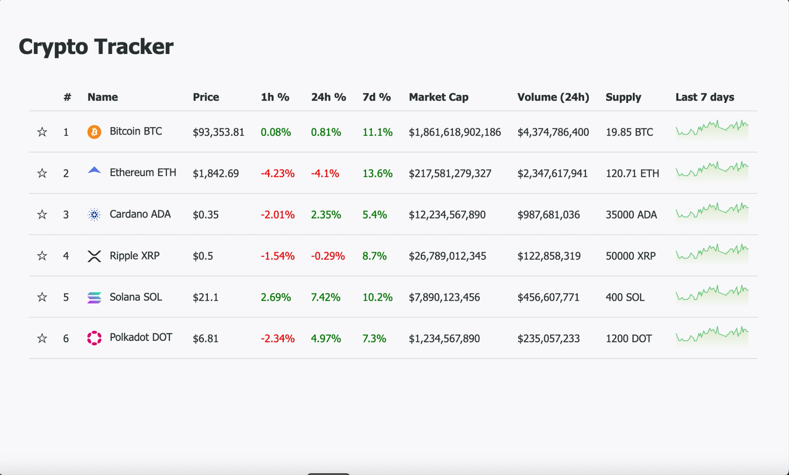

# Crypto Tracker Next.js

This is a Next.js + Redux Toolkit application that simulates real-time crypto price updates.

## Development

```
npm install
```

If you want to run the app in development mode, you can use the following command:

```
npm run dev
``` 
This will start the development server at `http://localhost:3000`.
## Production
To build the app for production, you can use the following command:

```
npm run build
```
This will create an optimized build of the app in the `.next` directory. You can then start the production server with:

```
npm start
```
This will start the production server at `http://localhost:3000`.

## Demo video
[](public/demo.mov)